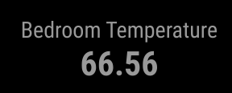

# MMM-HUD-InfluxDB
Magic Mirror module for displaying the latest measurement field out of a InfluxDB bucket.

## What does this module look like?



## To use add this to your `config.js`

```
{
    module: "MMM-HUD-InfluxDB",
    position: "top_center",
    config: {
        displayName: "Bedroom Temperature",
        token:"influxdb_token_here",
        url: "http://influxdb_hostname_here:8086/query",
        db: "influxdb_database_name_here",
        rp: "retention_policy_name_here",
        measurement: "measurement_name_here",
        field: "dht22_temperatureF",
        interval: 1000,
        width: '200px'
    }
},

```
